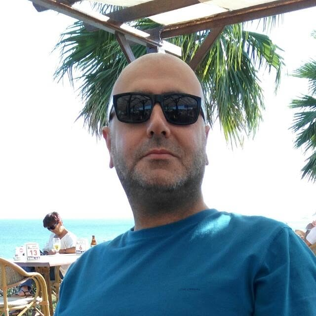

### KURALLAR

1. Bu bir tek sayfalı portfolyo web sayfası olacak.
2. Vite ile birlikte react js (javascript) kullanılacak.
3. web sitesini oluştururken bu renkler kullanılacak. #27104e #64379f #9854cb #ddacf5 #75e8e7  Bu renkleri göze hoş görünür şekilde sayfada kullanmak senin işin.

## HEADER

1. Header'da sol tarafa yaslanmış şekilde bu fotoğraf olacak. Bu fotoğrafı header da düzgün görünecek şekilde yeniden boyutlandır. 
2. Header'ın ortasında "BÜLENT ÜNLÜSÜ" yazacak.
   
## NAVIGATION BAR

Navigation elemeanları:
1. Ana Sayfa
2. İş Tecrübeleri
3. Hakkında
4. Eğitim
5. İletişim
   
## LEFT SIDEBAR

Sidebar link elemanları:
1. Ana Sayfa
2. İş Tecrübeleri
3. Hakkında
4. Eğitim
5. İletişim

## CONTENT

Navigation ve Sidebar' da bulunan linklere tıklandığında tıklanan linkin içeriği sayfanın ortasında yer alan Content bölümünde açılacak.

1. "Ana Sayfa" linki içeriği: Bina Otomasyon Uzmanı
2. "İş Tecrübeleri" linki İçeriği:
   1. Yazılım Departman Şefi - Umetek Mühendislik - 2011
   2. Proje Müdürü - Satek Mühendislik 2007-2010
   3. Proje Sorumlusu - SCS Tesisat 2000-2005
   4. Otomasyon Süpervizörü - Alsem Servis
   5. Otomasyon Süpervizörü - Alarko Almüt - 1990-1992
   6. Elektrik Teknisyeni - Güçberk Elektro - 1987-1990
3. "Hakkında" linki içeriği:
     1970 yılında Elazığ'da doğdum. İlk-Orta-Lise eğitimimi Konya ve İstanbul'da tamamladım.
4. "Eğitim" linki içeriği:
     Haydarpaşa Endüstri Meslek Lisesi - Elektrik Bölümü - 1987
5. "İletişim" linki içeriği:
   1. Linkedin logosu ve "https://linkedin.com/in/bulentunlusu" linki
   2. Instagram logosu ve "https://instagram.com/bulentunlusu" linki
   3. Mailbox logosu ve "info@bulentunlusu.com"
   
## FOOTER
bulentunlusu.com © 2026

